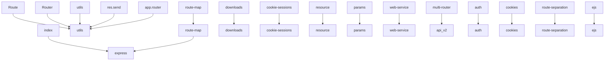

# 🚀 Onboarding Guide: express

*Auto-generated by [Codebase Onboarding Agent](https://github.com/sagarjhaa/codebase-onboard) v1.0*
*Generated: 2026-03-04 00:20*

> This guide was generated by analyzing the repository structure, configuration files,
> source code, and dependencies. It provides a comprehensive starting point for understanding
> this codebase.

**Complexity: 🟠 Complex** (44/100)

---

## 📋 Quick Overview

> [](https://expressjs.com/)

| Metric | Value |
|--------|-------|
| **Primary Language** | JavaScript |
| **Total Files** | 206 |
| **Total Lines** | 26,037 |
| **License** | MIT |
| **Test Framework** | Jest/Mocha, Mocha |
| **Database** | Redis |
| **API Endpoints** | 248 detected |
| **Complexity** | Complex (44/100) |

---

## 🛠 Tech Stack

### Languages
- **JavaScript**: 21,346 lines (100.0%) `████████████████████`

---

## 📂 Directory Structure

```
express_2b33375147cb/
├── .github/
│   ├── workflows/  ← GitHub Actions CI/CD
│   │   ├── ci.yml
│   │   ├── codeql.yml
│   │   ├── legacy.yml
│   │   └── scorecard.yml
│   └── dependabot.yml
├── examples/
│   ├── auth/
│   │   ├── views/
│   │   └── index.js
│   ├── content-negotiation/
│   │   ├── db.js
│   │   ├── index.js
│   │   └── users.js
│   ├── cookie-sessions/
│   │   └── index.js
│   ├── cookies/
│   │   └── index.js
│   ├── downloads/
│   │   ├── files/
│   │   └── index.js
│   ├── ejs/
│   │   ├── public/
│   │   ├── views/
│   │   └── index.js
│   ├── error/
│   │   └── index.js
│   ├── error-pages/
│   │   ├── views/
│   │   └── index.js
│   ├── hello-world/
│   │   └── index.js
│   ├── markdown/
│   │   ├── views/
│   │   └── index.js
│   ├── multi-router/
│   │   ├── controllers/
│   │   └── index.js
│   ├── mvc/
│   │   ├── controllers/
│   │   ├── lib/
│   │   ├── public/
│   │   ├── views/
│   │   ├── db.js
│   │   └── index.js
│   ├── online/
│   │   └── index.js
│   ├── params/
│   │   └── index.js
│   ├── resource/
│   │   └── index.js
│   ├── route-map/
│   │   └── index.js
│   ├── route-middleware/
│   │   └── index.js
│   ├── route-separation/
│   │   ├── public/
│   │   ├── views/
│   │   ├── index.js
│   │   ├── post.js
│   │   ├── site.js
│   │   └── user.js
│   ├── search/
│   │   ├── public/
│   │   └── index.js
│   ├── session/
│   │   ├── index.js
│   │   └── redis.js
│   ├── static-files/
│   │   ├── public/
│   │   └── index.js
│   ├── vhost/
│   │   └── index.js
│   ├── view-constructor/
│   │   ├── github-view.js
│   │   └── index.js
│   ├── view-locals/
│   │   ├── views/
│   │   ├── index.js
│   │   └── user.js
│   ├── web-service/
│   │   └── index.js
│   └── README.md
├── lib/
│   ├── application.js
│   ├── express.js
│   ├── request.js
│   ├── response.js
│   ├── utils.js
│   └── view.js
├── test/
│   ├── acceptance/
│   │   ├── auth.js
│   │   ├── content-negotiation.js
│   │   ├── cookie-sessions.js
│   │   ├── cookies.js
│   │   ├── downloads.js
│   │   ├── ejs.js
│   │   ├── error-pages.js
│   │   ├── error.js
│   │   ├── hello-world.js
│   │   ├── markdown.js
│   │   ├── multi-router.js
│   │   ├── mvc.js
│   │   ├── params.js
│   │   ├── resource.js
│   │   ├── route-map.js
│   │   ├── route-separation.js
│   │   ├── vhost.js
│   │   └── web-service.js
│   ├── fixtures/
│   │   ├── blog/
│   │   ├── default_layout/
│   │   ├── local_layout/
│   │   ├── pets/
│   │   ├── snow ☃/
│   │   ├── users/
│   │   ├── % of dogs.txt
│   │   ├── broken.send
│   │   ├── email.tmpl
│   │   ├── empty.txt
│   │   ├── name.tmpl
│   │   ├── name.txt
│   │   ├── nums.txt
│   │   ├── todo.html
│   │   ├── todo.txt
│   │   ├── user.html
│   │   └── user.tmpl
│   ├── support/
│   │   ├── env.js
│   │   ├── tmpl.js
│   │   └── utils.js
│   ├── app.all.js
│   ├── app.engine.js
│   ├── app.head.js
│   ├── app.js
│   ├── app.listen.js
│   ├── app.locals.js
│   ├── app.options.js
│   ├── app.param.js
│   ├── app.render.js
│   ├── app.request.js
│   ├── app.response.js
│   ├── app.route.js
│   ├── app.router.js
│   ├── app.routes.error.js
│   ├── app.use.js
│   ├── config.js
│   ├── exports.js
│   ├── express.json.js
│   ├── express.raw.js
│   ├── express.static.js
│   ├── express.text.js
│   ├── express.urlencoded.js
│   ├── middleware.basic.js
│   ├── regression.js
│   ├── req.accepts.js
│   ├── req.acceptsCharsets.js
│   ├── req.acceptsEncodings.js
│   ├── req.acceptsLanguages.js
│   ├── req.baseUrl.js
│   ├── req.fresh.js
│   ├── req.get.js
│   ├── req.host.js
│   ├── req.hostname.js
│   ├── req.ip.js
│   ├── req.ips.js
│   ├── req.is.js
│   ├── req.path.js
│   ├── req.protocol.js
│   ├── req.query.js
│   ├── req.range.js
│   ├── req.route.js
│   ├── req.secure.js
│   ├── req.signedCookies.js
│   ├── req.stale.js
│   ├── req.subdomains.js
│   ├── req.xhr.js
│   ├── res.append.js
│   ├── res.attachment.js
│   ├── res.clearCookie.js
│   ├── res.cookie.js
│   ├── res.download.js
│   ├── res.format.js
│   ├── res.get.js
│   ├── res.json.js
│   ├── res.jsonp.js
│   ├── res.links.js
│   ├── res.locals.js
│   ├── res.location.js
│   ├── res.redirect.js
│   ├── res.render.js
│   ├── res.send.js
│   ├── res.sendFile.js
│   ├── res.sendStatus.js
│   ├── res.set.js
│   ├── res.status.js
│   ├── res.type.js
... (9 more entries)
```

---

## 🏗 Architecture Overview

- Package description: Fast, unopinionated, minimalist web framework
- npm package name: `express`
- **Top-level directories:** `test/` (110 files), `examples/` (80 files), `lib/` (6 files), `.github/` (5 files)
- **API layer:** 35 files related to API routing/handlers.

### Patterns & Conventions
- **MVC Architecture**: Models, Views, and Controllers pattern detected.
- **MVT Architecture**: Models, Views, and Templates (Django-style) pattern detected.
- **Library Code**: Shared library code in `lib/` directory.
- **Separated Tests**: Dedicated `test/` or `tests/` directory.

---

## 🌐 API Endpoints

**248 endpoint(s) detected:**

### `test/express.json.js`

| Method | Path | Handler | Framework |
|--------|------|---------|-----------|
| `POST` | `/` | - | Express/Fastify |
| `POST` | `/` | - | Express/Fastify |
| `POST` | `/` | - | Express/Fastify |
| `POST` | `/` | - | Express/Fastify |

### `test/express.urlencoded.js`

| Method | Path | Handler | Framework |
|--------|------|---------|-----------|
| `POST` | `/` | - | Express/Fastify |
| `POST` | `/` | - | Express/Fastify |
| `POST` | `/` | - | Express/Fastify |
| `POST` | `/` | - | Express/Fastify |

### `test/req.baseUrl.js`

| Method | Path | Handler | Framework |
|--------|------|---------|-----------|
| `GET` | `/:a` | - | Express/Fastify |

### `test/express.raw.js`

| Method | Path | Handler | Framework |
|--------|------|---------|-----------|
| `POST` | `/` | - | Express/Fastify |
| `POST` | `/` | - | Express/Fastify |
| `POST` | `/` | - | Express/Fastify |
| `POST` | `/` | - | Express/Fastify |

### `test/app.routes.error.js`

| Method | Path | Handler | Framework |
|--------|------|---------|-----------|
| `GET` | `/bar` | - | Express/Fastify |
| `GET` | `/` | - | Express/Fastify |

### `test/express.text.js`

| Method | Path | Handler | Framework |
|--------|------|---------|-----------|
| `POST` | `/` | - | Express/Fastify |
| `POST` | `/` | - | Express/Fastify |
| `POST` | `/` | - | Express/Fastify |
| `POST` | `/` | - | Express/Fastify |
| `POST` | `/` | - | Hono |
| `POST` | `/` | - | Hono |
| `POST` | `/` | - | Hono |
| `POST` | `/` | - | Hono |

### `test/res.format.js`

| Method | Path | Handler | Framework |
|--------|------|---------|-----------|
| `GET` | `/` | - | Express/Fastify |

### `test/req.acceptsLanguages.js`

| Method | Path | Handler | Framework |
|--------|------|---------|-----------|
| `GET` | `/` | - | Express/Fastify |
| `GET` | `/` | - | Express/Fastify |
| `GET` | `/` | - | Express/Fastify |

### `test/res.json.js`

| Method | Path | Handler | Framework |
|--------|------|---------|-----------|
| `GET` | `/` | - | Express/Fastify |
| `GET` | `json escape` | - | Express/Fastify |
| `GET` | `json spaces` | - | Express/Fastify |

### `test/config.js`

| Method | Path | Handler | Framework |
|--------|------|---------|-----------|
| `GET` | `foo` | - | Express/Fastify |
| `GET` | `hasOwnProperty` | - | Express/Fastify |
| `GET` | `etag fn` | - | Express/Fastify |
| `GET` | `trust proxy fn` | - | Express/Fastify |
| `GET` | `foo` | - | Express/Fastify |
| `GET` | `hasOwnProperty` | - | Express/Fastify |
| `GET` | `foo` | - | Express/Fastify |
| `GET` | `trust proxy` | - | Express/Fastify |
| `GET` | `trust proxy fn` | - | Express/Fastify |
| `GET` | `trust proxy` | - | Express/Fastify |
| `GET` | `trust proxy fn` | - | Express/Fastify |
| `GET` | `trust proxy` | - | Express/Fastify |
| `GET` | `trust proxy fn` | - | Express/Fastify |
| `GET` | `tobi` | - | Express/Fastify |
| `GET` | `hasOwnProperty` | - | Express/Fastify |
| `GET` | `tobi` | - | Express/Fastify |
| `GET` | `hasOwnProperty` | - | Express/Fastify |

### `test/res.download.js`

| Method | Path | Handler | Framework |
|--------|------|---------|-----------|
| `GET` | `/` | - | Express/Fastify |
| `GET` | `/` | - | Express/Fastify |

### `test/regression.js`

| Method | Path | Handler | Framework |
|--------|------|---------|-----------|
| `GET` | `/` | - | Express/Fastify |

### `test/app.head.js`

| Method | Path | Handler | Framework |
|--------|------|---------|-----------|
| `GET` | `/tobi` | - | Express/Fastify |
| `GET` | `/tobi` | - | Express/Fastify |
| `HEAD` | `/tobi` | - | Express/Fastify |
| `GET` | `/tobi` | - | Express/Fastify |

### `test/app.all.js`

| Method | Path | Handler | Framework |
|--------|------|---------|-----------|
| `ALL` | `/tobi` | - | Express/Fastify |
| `ALL` | `/*splat` | - | Express/Fastify |

### `test/res.jsonp.js`

| Method | Path | Handler | Framework |
|--------|------|---------|-----------|
| `GET` | `/` | - | Express/Fastify |
| `GET` | `/` | - | Express/Fastify |
| `GET` | `json escape` | - | Express/Fastify |
| `GET` | `json spaces` | - | Express/Fastify |

### `test/Router.js`

| Method | Path | Handler | Framework |
|--------|------|---------|-----------|
| `GET` | `/foo` | - | Express/Fastify |
| `GET` | `/thing` | - | Express/Fastify |
| `GET` | `/` | - | Express/Fastify |
| `GET` | `/foo` | - | Express/Fastify |
| `GET` | `/foo` | - | Express/Fastify |
| `GET` | `/foo` | - | Express/Fastify |
| `GET` | `/foo` | - | Express/Fastify |
| `GET` | `/bar` | - | Express/Fastify |
| `GET` | `/foo/:id` | - | Express/Fastify |
| `ALL` | `/foo` | - | Express/Fastify |
| `GET` | `/foo/:id/bar` | - | Express/Fastify |

### `test/req.acceptsEncodings.js`

| Method | Path | Handler | Framework |
|--------|------|---------|-----------|
| `GET` | `/` | - | Express/Fastify |
| `GET` | `/` | - | Express/Fastify |

### `test/req.xhr.js`

| Method | Path | Handler | Framework |
|--------|------|---------|-----------|
| `GET` | `/` | - | Express/Fastify |

### `test/app.router.js`

| Method | Path | Handler | Framework |
|--------|------|---------|-----------|
| `GET` | `/user/:id` | - | Express/Fastify |
| `DELETE` | `/` | - | Express/Fastify |
| `GET` | `/:name` | - | Express/Fastify |
| `GET` | `/:name` | - | Express/Fastify |
| `GET` | `/:name` | - | Express/Fastify |
| `GET` | `/:name` | - | Express/Fastify |
| `GET` | `/` | - | Express/Fastify |
| `GET` | `/user` | - | Express/Fastify |
| `GET` | `/uSer` | - | Express/Fastify |
| `GET` | `/uSer` | - | Express/Fastify |
| `GET` | `/:action` | - | Express/Fastify |
| `GET` | `/:action` | - | Express/Fastify |
| `GET` | `/:thing` | - | Express/Fastify |
| `GET` | `/:name` | - | Express/Fastify |
| `GET` | `/user` | - | Express/Fastify |
| `GET` | `/user/` | - | Express/Fastify |
| `GET` | `/user/` | - | Express/Fastify |
| `GET` | `/user/test/` | - | Express/Fastify |
| `GET` | `/user` | - | Express/Fastify |
| `GET` | `/user/` | - | Express/Fastify |
| `GET` | `/user` | - | Express/Fastify |
| `GET` | `/api/users/:from..:to` | - | Express/Fastify |
| `GET` | `/user/:user` | - | Express/Fastify |
| `GET` | `/user/:user` | - | Express/Fastify |
| `GET` | `/user/:user/:op` | - | Express/Fastify |
| `GET` | `/user{s}/:user/:op` | - | Express/Fastify |
| `GET` | `/:user\\(:op\\)` | - | Express/Fastify |
| `GET` | `/user/:user{/:op}` | - | Express/Fastify |
| `GET` | `/user/:user{/:op}` | - | Express/Fastify |
| `GET` | `/user/*user` | - | Express/Fastify |

### `test/app.param.js`

| Method | Path | Handler | Framework |
|--------|------|---------|-----------|
| `GET` | `/post/:id` | - | Express/Fastify |
| `GET` | `/user/:uid` | - | Express/Fastify |
| `GET` | `/user/:id` | - | Express/Fastify |
| `GET` | `/foo/:user` | - | Express/Fastify |
| `GET` | `/foo/:user` | - | Express/Fastify |
| `GET` | `/:user/bob` | - | Express/Fastify |
| `GET` | `/foo/:user` | - | Express/Fastify |
| `GET` | `/:user` | - | Express/Fastify |
| `GET` | `/:user` | - | Express/Fastify |
| `POST` | `/:user` | - | Express/Fastify |
| `GET` | `/:thing` | - | Express/Fastify |
| `GET` | `/user/:name` | - | Express/Fastify |
| `GET` | `/user/:id` | - | Express/Fastify |
| `GET` | `/user/:id` | - | Express/Fastify |
| `GET` | `/user/:id` | - | Express/Fastify |
| `GET` | `/:name/123` | - | Express/Fastify |
| `ALL` | `/user/:id` | - | Express/Fastify |
| `GET` | `/user/:id` | - | Express/Fastify |
| `GET` | `/user/new` | - | Express/Fastify |
| `GET` | `/:user/bob` | - | Express/Fastify |
| `GET` | `/foo/:user` | - | Express/Fastify |
| `GET` | `/:user/bob` | - | Express/Fastify |
| `GET` | `/foo/:user` | - | Express/Fastify |

### `test/req.secure.js`

| Method | Path | Handler | Framework |
|--------|------|---------|-----------|
| `GET` | `/` | - | Express/Fastify |
| `GET` | `/` | - | Express/Fastify |
| `GET` | `/` | - | Express/Fastify |
| `GET` | `/` | - | Express/Fastify |
| `GET` | `/` | - | Express/Fastify |
| `GET` | `/` | - | Express/Fastify |

### `test/app.js`

| Method | Path | Handler | Framework |
|--------|------|---------|-----------|
| `GET` | `env` | - | Express/Fastify |

### `test/app.options.js`

| Method | Path | Handler | Framework |
|--------|------|---------|-----------|
| `POST` | `/` | - | Express/Fastify |
| `GET` | `/users` | - | Express/Fastify |
| `PUT` | `/users` | - | Express/Fastify |
| `DELETE` | `/` | - | Express/Fastify |
| `GET` | `/users` | - | Express/Fastify |
| `PUT` | `/users` | - | Express/Fastify |
| `GET` | `/users` | - | Express/Fastify |
| `GET` | `/` | - | Express/Fastify |
| `GET` | `/users` | - | Express/Fastify |
| `PUT` | `/users` | - | Express/Fastify |
| `ALL` | `/users` | - | Express/Fastify |
| `GET` | `/users` | - | Express/Fastify |
| `GET` | `/users` | - | Express/Fastify |
| `GET` | `/other` | - | Express/Fastify |
| `GET` | `/users` | - | Express/Fastify |
| `OPTIONS` | `/users` | - | Express/Fastify |
| `GET` | `/users` | - | Express/Fastify |
| `PUT` | `/users` | - | Express/Fastify |

### `test/req.ip.js`

| Method | Path | Handler | Framework |
|--------|------|---------|-----------|
| `GET` | `/` | - | Express/Fastify |

### `test/req.route.js`

| Method | Path | Handler | Framework |
|--------|------|---------|-----------|
| `GET` | `/user/:id{/:op}` | - | Express/Fastify |
| `GET` | `/user/:id/edit` | - | Express/Fastify |

### `examples/auth/index.js`

| Method | Path | Handler | Framework |
|--------|------|---------|-----------|
| `GET` | `/` | - | Express/Fastify |
| `GET` | `/restricted` | - | Express/Fastify |
| `GET` | `/logout` | - | Express/Fastify |
| `GET` | `/login` | - | Express/Fastify |
| `POST` | `/login` | - | Express/Fastify |

### `examples/markdown/index.js`

| Method | Path | Handler | Framework |
|--------|------|---------|-----------|
| `GET` | `/` | - | Express/Fastify |
| `GET` | `/fail` | - | Express/Fastify |

### `examples/multi-router/index.js`

| Method | Path | Handler | Framework |
|--------|------|---------|-----------|
| `GET` | `/` | - | Express/Fastify |

### `examples/view-locals/index.js`

| Method | Path | Handler | Framework |
|--------|------|---------|-----------|
| `GET` | `/` | - | Express/Fastify |
| `GET` | `/middleware` | - | Express/Fastify |
| `GET` | `/middleware-locals` | - | Express/Fastify |
| `ALL` | `/api/*` | - | Express/Fastify |

### `examples/view-constructor/index.js`

| Method | Path | Handler | Framework |
|--------|------|---------|-----------|
| `GET` | `/` | - | Express/Fastify |
| `GET` | `/Readme.md` | - | Express/Fastify |

### `examples/route-separation/index.js`

| Method | Path | Handler | Framework |
|--------|------|---------|-----------|
| `GET` | `/` | - | Express/Fastify |
| `GET` | `/users` | - | Express/Fastify |
| `ALL` | `/user/:id{/:op}` | - | Express/Fastify |
| `GET` | `/user/:id` | - | Express/Fastify |
| `GET` | `/user/:id/view` | - | Express/Fastify |
| `GET` | `/user/:id/edit` | - | Express/Fastify |
| `PUT` | `/user/:id/edit` | - | Express/Fastify |
| `GET` | `/posts` | - | Express/Fastify |

### `examples/cookie-sessions/index.js`

| Method | Path | Handler | Framework |
|--------|------|---------|-----------|
| `GET` | `/` | - | Express/Fastify |

### `examples/ejs/index.js`

| Method | Path | Handler | Framework |
|--------|------|---------|-----------|
| `GET` | `/` | - | Express/Fastify |

### `examples/hello-world/index.js`

| Method | Path | Handler | Framework |
|--------|------|---------|-----------|
| `GET` | `/` | - | Express/Fastify |

### `examples/search/index.js`

| Method | Path | Handler | Framework |
|--------|------|---------|-----------|
| `GET` | `/search/{:query}` | - | Express/Fastify |
| `GET` | `/client.js` | - | Express/Fastify |

### `examples/web-service/index.js`

| Method | Path | Handler | Framework |
|--------|------|---------|-----------|
| `GET` | `/api/users` | - | Express/Fastify |
| `GET` | `/api/repos` | - | Express/Fastify |
| `GET` | `/api/user/:name/repos` | - | Express/Fastify |

### `examples/error-pages/index.js`

| Method | Path | Handler | Framework |
|--------|------|---------|-----------|
| `GET` | `/` | - | Express/Fastify |
| `GET` | `/404` | - | Express/Fastify |
| `GET` | `/403` | - | Express/Fastify |
| `GET` | `/500` | - | Express/Fastify |

### `examples/params/index.js`

| Method | Path | Handler | Framework |
|--------|------|---------|-----------|
| `GET` | `/` | - | Express/Fastify |
| `GET` | `/user/:user` | - | Express/Fastify |
| `GET` | `/users/:from-:to` | - | Express/Fastify |

### `examples/online/index.js`

| Method | Path | Handler | Framework |
|--------|------|---------|-----------|
| `GET` | `/` | - | Express/Fastify |

### `examples/resource/index.js`

| Method | Path | Handler | Framework |
|--------|------|---------|-----------|
| `GET` | `/` | - | Express/Fastify |

### `examples/downloads/index.js`

| Method | Path | Handler | Framework |
|--------|------|---------|-----------|
| `GET` | `/` | - | Express/Fastify |
| `GET` | `/files/*file` | - | Express/Fastify |

### `examples/error/index.js`

| Method | Path | Handler | Framework |
|--------|------|---------|-----------|
| `GET` | `env` | - | Express/Fastify |
| `GET` | `/` | - | Express/Fastify |
| `GET` | `/next` | - | Express/Fastify |

### `examples/route-middleware/index.js`

| Method | Path | Handler | Framework |
|--------|------|---------|-----------|
| `GET` | `/` | - | Express/Fastify |
| `GET` | `/user/:id` | - | Express/Fastify |
| `GET` | `/user/:id/edit` | - | Express/Fastify |
| `DELETE` | `/user/:id` | - | Express/Fastify |

### `examples/cookies/index.js`

| Method | Path | Handler | Framework |
|--------|------|---------|-----------|
| `GET` | `/` | - | Express/Fastify |
| `GET` | `/forget` | - | Express/Fastify |
| `POST` | `/` | - | Express/Fastify |

### `examples/content-negotiation/index.js`

| Method | Path | Handler | Framework |
|--------|------|---------|-----------|
| `GET` | `/` | - | Express/Fastify |
| `GET` | `/users` | - | Express/Fastify |

### `examples/session/index.js`

| Method | Path | Handler | Framework |
|--------|------|---------|-----------|
| `GET` | `/` | - | Express/Fastify |

### `examples/session/redis.js`

| Method | Path | Handler | Framework |
|--------|------|---------|-----------|
| `GET` | `/` | - | Express/Fastify |

### `lib/response.js`

| Method | Path | Handler | Framework |
|--------|------|---------|-----------|
| `GET` | `etag fn` | - | Express/Fastify |
| `GET` | `json escape` | - | Express/Fastify |
| `GET` | `json replacer` | - | Express/Fastify |
| `GET` | `json spaces` | - | Express/Fastify |
| `GET` | `json escape` | - | Express/Fastify |
| `GET` | `json replacer` | - | Express/Fastify |
| `GET` | `json spaces` | - | Express/Fastify |
| `GET` | `jsonp callback name` | - | Express/Fastify |
| `GET` | `/user/:uid/photos/:file` | - | Express/Fastify |


---

## 🗄️ Database

**Databases:** Redis
**ORM/Driver:** Redis

---

## 🔐 Authentication & Authorization

**Auth patterns:**
- Session-based Auth

**Key auth files:** `test/acceptance/cookie-sessions.js`, `test/acceptance/auth.js`, `examples/auth/index.js`, `examples/cookie-sessions/index.js`, `examples/session/index.js`, `examples/session/redis.js`

---

## 🚪 Entry Points

Where execution begins:

### `index.js`


---

## 📄 Key Files

### Configuration
- **`package.json`** — Node.js project manifest

### 🔥 Hot Files (most imported/changed)
- **`test/support/utils.js`** — imported by 10 files
- **`test/utils.js`** — imported by 7 files
- **`lib/utils.js`** — imported by 5 files
- **`examples/mvc/db.js`** — imported by 5 files
- **`lib/express.js`** — imported by 3 files
- **`test/support/tmpl.js`** — imported by 2 files
- **`examples/mvc/controllers/user-pet/index.js`** — imported by 2 files
- **`examples/route-map/index.js`** — imported by 1 files
- **`examples/downloads/index.js`** — imported by 1 files
- **`examples/cookie-sessions/index.js`** — imported by 1 files

### Largest Source Files
- **`test/app.router.js`** (1217 lines, JavaScript) — functions: handler1, handler2, fn, fn, fn1
- **`lib/response.js`** (1047 lines, JavaScript) — functions: sendfile, onaborted, ondirectory, onerror, onend
- **`test/res.sendFile.js`** (913 lines, JavaScript) — functions: handleHeaders, createApp
- **`test/express.urlencoded.js`** (828 lines, JavaScript) — functions: accept, accept, accept, createManyParams, createApp
- **`test/express.static.js`** (815 lines, JavaScript) — functions: createApp
- **`test/express.json.js`** (755 lines, JavaScript) — functions: accept, accept, accept, createApp, parseError
- **`test/Router.js`** (636 lines, JavaScript) — functions: no, fn1, fn2
- **`lib/application.js`** (631 lines, JavaScript) — functions: logerror, tryRender
- **`test/res.send.js`** (569 lines, JavaScript)
- **`test/express.text.js`** (566 lines, JavaScript) — functions: accept, accept, accept, createApp

---

## 🔗 Dependency Graph



---

## ⚡ Getting Started

### Prerequisites
- Node.js 18+ (LTS)

### Installation

```bash
git clone https://github.com/expressjs/express
cd express


# Create .env with required variables (see Environment Variables section)
```

### Available Scripts

- **`lint`** — `eslint .`
- **`lint:fix`** — `eslint . --fix`
- **`test`** — `mocha --require test/support/env --reporter spec --check-leaks test/ test/acceptance/`
- **`test-ci`** — `nyc --exclude examples --exclude test --exclude benchmarks --reporter=lcovonly --reporter=text npm test`
- **`test-cov`** — `nyc --exclude examples --exclude test --exclude benchmarks --reporter=html --reporter=text npm test`
- **`test-tap`** — `mocha --require test/support/env --reporter tap --check-leaks test/ test/acceptance/`

---

## 🔄 Patterns & Conventions

- **MVC Architecture**: Models, Views, and Controllers pattern detected.
- **MVT Architecture**: Models, Views, and Templates (Django-style) pattern detected.
- **Library Code**: Shared library code in `lib/` directory.
- **Separated Tests**: Dedicated `test/` or `tests/` directory.

---

## 📦 Dependencies

### Other (28 packages)
- `accepts` ^2.0.0
- `body-parser` ^2.2.1
- `content-disposition` ^1.0.0
- `content-type` ^1.0.5
- `cookie` ^0.7.1
- `cookie-signature` ^1.2.1
- `debug` ^4.4.0
- `depd` ^2.0.0
- `encodeurl` ^2.0.0
- `escape-html` ^1.0.3
- *... and 18 more*


---

## 🧪 Testing

**Frameworks:** Jest/Mocha, Mocha
**Test files:** 91
**Coverage estimate:** High
**Test-to-source ratio:** 1.82

**Test locations:**
- `test/`: 91 test files

### Running Tests

```bash
npm test
npx jest --watch  # watch mode
```

---

## 🔄 CI/CD

**Provider:** GitHub Actions
**Config files:** `.github/workflows/ci.yml`, `.github/workflows/codeql.yml`, `.github/workflows/legacy.yml`, `.github/workflows/scorecard.yml`
**Pipeline features:** ✅ Linting | ✅ Build | ✅ Deploy

### Pipelines
- **ci** (triggers: push, branches, pull_request, workflow_dispatch) → jobs: push, pull_request, workflow_dispatch, contents, group
- **codeql** (triggers: push, branches, pull_request, branches) → jobs: push, pull_request, schedule, workflow_dispatch, contents
- **legacy** (triggers: push, branches, pull_request, workflow_dispatch) → jobs: push, pull_request, workflow_dispatch, contents, group
- **scorecard** (triggers: branch_protection_rule, schedule, push, branches) → jobs: branch_protection_rule, schedule, push, analysis

---

## 🔐 Environment Variables

| Variable | Referenced In |
|----------|-------------|
| `NODE_ENV` | `examples/cookies/index.js`, `examples/error-pages/index.js`, `examples/route-map/index.js` +3 more |
| `NO_DEPRECATION` | `test/support/env.js` |

*Check `.env.example` or ask your team for values.*

---

## ⚠️ Gotchas & Potential Issues

- **39 TODO/FIXME/HACK comments** found — review for known issues and tech debt.
- **Large source files**: `test/app.router.js` (1217 lines), `lib/response.js` (1047 lines), `test/res.sendFile.js` (913 lines), `test/express.urlencoded.js` (828 lines), `test/express.static.js` (815 lines)

### Notable TODOs/FIXMEs

- `test/express.static.js`: .get('/todo.txt')
- `test/express.static.js`: .get('/todo.txt')
- `test/express.static.js`: .get('/todo.txt')
- `test/express.static.js`: .get('/todo.txt')
- `test/express.static.js`: .get('//todo@txt')
- `test/express.static.js`: .get('/users/../todo.txt')
- `test/express.static.js`: .head('/todo.txt')
- `test/express.static.js`: .post('/todo.txt')
- `test/express.static.js`: .get('/todo.txt')
- `test/express.static.js`: .get('/todo.txt')
- `test/express.static.js`: .get('/todo.txt')
- `test/express.static.js`: .get('/' + dest + '/todo.txt')
- `test/express.static.js`: .get('/todo')
- `test/express.static.js`: .get('/todo')
- `test/express.static.js`: .get('/todo')
- *... and 24 more*

---

## 💡 Key Concepts & Terminology

Domain-specific terms and abstractions found in the codebase:

- **`GithubView`** — found in `examples/view-constructor/github-view.js`

---

## 🎯 Your First PR

### Suggested Areas
- 📝 **Add or improve tests** — Great way to learn the codebase while adding value
- 📖 **Improve documentation** — Fix typos, add examples, clarify confusing sections
- 🔧 **Address TODO/FIXME comments** — There are 39 across the codebase
- 🏷️ **Add TypeScript types** — If the project accepts TS, adding types to JS files is a safe improvement
- 🧹 **Add linting/formatting config** — Improves code consistency

### Conventions to Follow
- 🌿 No consistent branch naming pattern detected — ask your team

### Good First Files to Explore
- `examples/view-constructor/github-view.js`
- `examples/vhost/index.js`
- `examples/error/index.js`
- `examples/cookies/index.js`
- `test/app.listen.js`
- `examples/route-separation/index.js`
- `test/req.acceptsLanguages.js`
- `examples/ejs/index.js`

---

## 🗺️ Next Steps

1. **Read the README** thoroughly
2. **Set up your dev environment** using the steps above
3. **Run the tests** to verify everything works
4. **Explore the entry points**: `index.js`
5. **Review API endpoints** — understand the public interface
6. **Check CI/CD pipelines** — understand the deployment process

### Questions to Ask Your Team

- What's the branching strategy?
- What's the PR review process?
- Are there ongoing refactors to be aware of?
- Who owns which parts? (Check CODEOWNERS if it exists)
- What's the deployment process and cadence?
- Any external services/systems not in this repo?